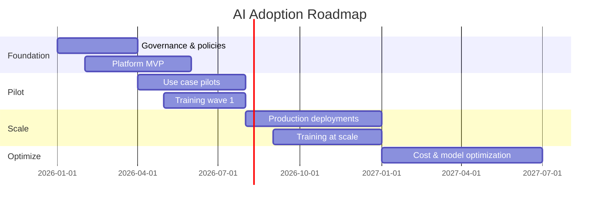

# AI Adoption Roadmap Diagram

Visual representation of the phased AI adoption timeline.

```mermaid
gantt
    title AI Adoption Roadmap
    dateFormat  YYYY-MM
    section Foundation
    Governance & policies     :a1, 2026-01, 3M
    Platform MVP              :a2, 2026-02, 4M
    section Pilot
    Use case pilots           :b1, 2026-04, 4M
    Training wave 1           :b2, 2026-05, 3M
    section Scale
    Production deployments    :c1, 2026-08, 5M
    Training at scale         :c2, 2026-09, 4M
    section Optimize
    Cost & model optimization :d1, 2027-01, 6M
```

See `docs/06-ai-adoption-roadmap.md` for detailed milestones and exit criteria.
