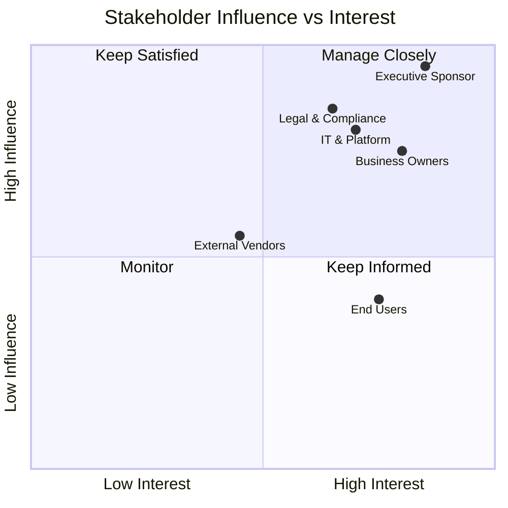

# Stakeholder Map Diagram

Visual representation of key stakeholder groups and relationships.

```mermaid
quadrantChart
    title Stakeholder Influence vs Interest
    x-axis Low Interest --> High Interest
    y-axis Low Influence --> High Influence
    quadrant-1 Manage Closely
    quadrant-2 Keep Satisfied
    quadrant-3 Monitor
    quadrant-4 Keep Informed
    Executive Sponsor: [0.85, 0.95]
    Business Owners: [0.80, 0.75]
    IT & Platform: [0.70, 0.80]
    Legal & Compliance: [0.65, 0.85]
    End Users: [0.75, 0.40]
    External Vendors: [0.45, 0.55]
```

See `docs/04-stakeholder-analysis.md` for engagement strategies and contact details.
